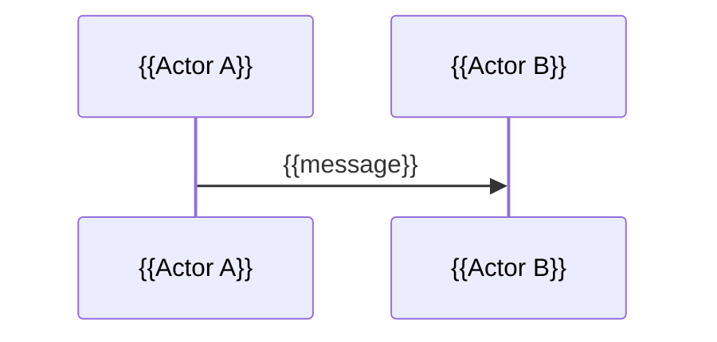

# Đặc tả tính năng: {{FEATURE_NAME}}

> Markdown là source of truth. HTML chỉ là bản trình bày để review/gửi team.

---

## 1. Metadata tài liệu

| Trường | Giá trị |
|---|---|
| Document ID | {{DOC_ID}} |
| Tên tính năng | {{FEATURE_NAME}} |
| Loại tính năng | {{new_feature / feature_upgrade}} |
| Phiên bản | {{VERSION}} |
| Trạng thái | {{Draft / In Review / Approved / Deprecated}} |
| BA / Owner | {{OWNER}} |
| PO / Stakeholder | {{STAKEHOLDER}} |
| Ngày tạo | {{YYYY-MM-DD}} |
| Cập nhật lần cuối | {{YYYY-MM-DD}} |
| Release mục tiêu | {{TARGET_RELEASE_OR_UNKNOWN}} |
| Source of truth | `feature-spec.md` |
| Output package | `{{PACKAGE_PATH}}` |
| Epic | {{EPIC_NAME_OR_ASSUMPTION}} |
| Story | {{STORY_NAME_OR_ASSUMPTION}} |

---

## 2. Tóm tắt đầu vào

### 2.1 Phân loại input

| Loại input | Có/Không | Ghi chú |
|---|---:|---|
| Business text | {{Có/Không}} | {{summary}} |
| Figma screenshot | {{Có/Không}} | {{summary}} |
| Figma link | {{Có/Không}} | {{summary}} |
| Related files | {{Có/Không}} | {{summary}} |
| Existing spec | {{Có/Không}} | {{summary}} |
| Change request | {{Có/Không}} | {{summary}} |
| Unclear input | {{Có/Không}} | {{summary}} |

### 2.2 Nguồn tham chiếu

| Source ID | Loại nguồn | Tên / Link / Mô tả | Dùng để trích xuất |
|---|---|---|---|
| SRC-001 | {{business_text/file/figma/screenshot}} | {{source_name_or_clickable_link}} | {{what_was_extracted}} |

### 2.3 Nhật ký bằng chứng

| Evidence ID | Nguồn | Trạng thái xử lý | Bằng chứng trích xuất | Ảnh hưởng đến spec |
|---|---|---|---|---|
| EVD-001 | {{User text / File / Figma}} | {{Đã xử lý / Không khả dụng / Lỗi / Bỏ qua theo yêu cầu}} | {{summary}} | {{impact}} |

### 2.4 Nhật ký bằng chứng Figma

> Bắt buộc nếu input có Figma URL hoặc Figma screenshot. Không được ghi `[FIGMA]` nếu chưa có bằng chứng được trích xuất từ MCP/screenshot/exported frame.

| Figma ID | Label | Bước nghiệp vụ | Link Figma gốc | Node ID | Kết quả MCP | Bằng chứng UI trích xuất | Ghi chú / fallback |
|---|---|---|---|---|---|---|---|
| FIG-001 | {{label}} | {{business_step}} | [{{label}}]({{original_figma_url}}) | {{node_id}} | {{MCP_SUCCESS / MCP_UNAVAILABLE / MCP_FAILED / USER_SKIPPED / SCREENSHOT_ONLY}} | {{visible_ui_evidence_or_empty}} | {{notes}} |

### 2.5 Danh mục link Figma gốc

> Bắt buộc khi có Figma URL. Dev/QA phải mở được thiết kế gốc từ bảng này. Không được chỉ ghi node-id mà bỏ link.

| ID | Label | Bước nghiệp vụ | Link Figma | Ghi chú |
|---|---|---|---|---|
| FIG-LINK-001 | {{label}} | {{business_step}} | [{{label}}]({{original_figma_url}}) | {{notes}} |

---

## 3. Quy ước nguồn và độ chắc chắn

| Tag | Ý nghĩa |
|---|---|
| `[PROVIDED]` | Người dùng cung cấp trực tiếp |
| `[FIGMA]` | Trích xuất từ Figma screenshot/link/MCP |
| `[FILE]` | Trích xuất từ file liên quan |
| `[INFERRED]` | Suy luận hợp lý từ thông tin có sẵn |
| `[ASSUMPTION]` | Giả định để draft chạy được, cần xác nhận |
| `[OPEN_QUESTION]` | Câu hỏi còn mở, có thể ảnh hưởng scope/logic/test |

---

## 4. Tổng quan tính năng

### 4.1 Tóm tắt

{{Một đoạn ngắn mô tả tính năng bằng tiếng Việt.}}

### 4.2 Vấn đề / Cơ hội nghiệp vụ

{{Tính năng giải quyết vấn đề gì hoặc tạo giá trị gì.}}

### 4.3 Kết quả mong muốn

{{Outcome nghiệp vụ sau khi tính năng được triển khai.}}

---

## 5. Mục tiêu nghiệp vụ

| ID | Mục tiêu | Ưu tiên | Nguồn |
|---|---|---|---|
| BG-001 | {{goal}} | {{Must/Should/Could}} | {{source_tag}} |

---

## 6. Phạm vi

### 6.1 Trong phạm vi

| ID | Hạng mục | Nguồn |
|---|---|---|
| S-IN-001 | {{in_scope_item}} | {{source_tag}} |

### 6.2 Ngoài phạm vi

| ID | Hạng mục | Lý do / Ghi chú |
|---|---|---|
| S-OUT-001 | {{out_of_scope_item}} | {{reason_or_source}} |

### 6.3 Có thể xem xét trong tương lai

| ID | Hạng mục | Lý do |
|---|---|---|
| FUT-001 | {{future_item}} | {{reason}} |

---

## 7. Stakeholder và vai trò

### 7.1 Stakeholder

| ID | Stakeholder | Vai trò trong quyết định | Ghi chú |
|---|---|---|---|
| STK-001 | {{stakeholder}} | {{decision/input/approval}} | {{notes}} |

### 7.2 User roles / actors

| ID | Role / Actor | Mô tả | Tóm tắt quyền | Nguồn |
|---|---|---|---|---|
| ROLE-001 | {{role_name}} | {{description}} | {{summary}} | {{source_tag}} |

---

## 8. User stories

| ID | User story | Ưu tiên | Nguồn |
|---|---|---|---|
| US-001 | Là {{role}}, tôi muốn {{action}}, để {{benefit}}. | {{Must/Should/Could}} | {{source_tag}} |

---

## 9. Luồng nghiệp vụ

### 9.1 Luồng chính

| Step ID | Actor | Trigger / Action | Phản hồi của hệ thống | Trạng thái kết quả | Nguồn |
|---|---|---|---|---|---|
| FLOW-001 | {{actor}} | {{action}} | {{response}} | {{state}} | {{source_tag}} |

### 9.2 Luồng thay thế

| Flow ID | Điều kiện | Các bước | Kết quả | Nguồn |
|---|---|---|---|---|
| ALT-001 | {{condition}} | {{steps}} | {{outcome}} | {{source_tag}} |

### 9.3 Flow diagram

```mermaid
flowchart TD
  A[Bắt đầu] --> B[{{Step}}]
  B --> C{Điều kiện?}
  C -->|Có| D[{{Outcome}}]
  C -->|Không| E[{{Alternative outcome}}]
```

---

## 10. Functional requirements

| ID | Requirement | Ưu tiên | Role liên quan | Flow liên quan | Nguồn |
|---|---|---|---|---|---|
| FR-001 | Hệ thống phải {{behavior}}. | {{Must/Should/Could}} | {{ROLE-001}} | {{FLOW-001}} | {{source_tag}} |

---

## 11. Business rules

Business rule là quyết định/ràng buộc nghiệp vụ. Không ghi lẫn implementation detail.

| ID | Rule | Áp dụng cho | Ưu tiên | Nguồn |
|---|---|---|---|---|
| BR-001 | {{business_rule}} | {{role/flow/state/data}} | {{Must/Should/Could}} | {{source_tag}} |

---

## 12. Data requirements

### 12.1 Trường dữ liệu nghiệp vụ

| ID | Field | Ý nghĩa nghiệp vụ | Bắt buộc | Format / Allowed values | Nguồn |
|---|---|---|---:|---|---|
| DR-001 | {{field_name}} | {{meaning}} | {{Có/Không/Có điều kiện}} | {{format_or_values}} | {{source_tag}} |

### 12.2 Quy tắc tạo/cập nhật dữ liệu

| ID | Data object | Sự kiện | Thay đổi dữ liệu | Nguồn |
|---|---|---|---|---|
| DR-101 | {{object}} | {{event}} | {{change}} | {{source_tag}} |

---

## 13. Validation rules

| ID | Field / Action | Validation rule | Error message / Behavior | Nguồn |
|---|---|---|---|---|
| VR-001 | {{field_or_action}} | {{rule}} | {{message_or_behavior}} | {{source_tag}} |

---

## 14. Permission matrix

| Permission ID | Role | View | Create | Update | Delete | Approve | Reject | Export | Ghi chú |
|---|---|---:|---:|---:|---:|---:|---:|---:|---|
| PERM-001 | {{role}} | {{Y/N}} | {{Y/N}} | {{Y/N}} | {{Y/N}} | {{Y/N}} | {{Y/N}} | {{Y/N}} | {{notes}} |

---

## 15. State transition

### 15.1 Danh sách trạng thái

| State ID | State | Mô tả | Terminal? | Nguồn |
|---|---|---|---:|---|
| STATE-001 | {{state}} | {{description}} | {{Có/Không}} | {{source_tag}} |

### 15.2 Quy tắc chuyển trạng thái

| ID | From state | Trigger / Action | Điều kiện | To state | Actor | Nguồn |
|---|---|---|---|---|---|---|
| TR-001 | {{from}} | {{trigger}} | {{condition}} | {{to}} | {{actor}} | {{source_tag}} |

### 15.3 State diagram

```mermaid
stateDiagram-v2
  [*] --> {{initial_state}}
  {{initial_state}} --> {{next_state}}: {{trigger}}
  {{next_state}} --> [*]
```

### 15.4 Sơ đồ bổ sung nếu cần

Dùng Mermaid cho các sơ đồ phức tạp khác như sequence, swimlane-style flowchart, hoặc sub-flow theo vai trò. HTML phải render các sơ đồ này bằng Mermaid.js CDN và vẫn giữ source fallback.



---

## 16. Edge cases & error handling

### 16.1 Edge cases

| ID | Scenario | Expected behavior | Nguồn |
|---|---|---|---|
| EC-001 | {{scenario}} | {{expected_behavior}} | {{source_tag}} |

### 16.2 Error handling

| ID | Error / Failure | User-facing behavior | System behavior | Nguồn |
|---|---|---|---|---|
| ERR-001 | {{error}} | {{message_or_ui_behavior}} | {{system_behavior}} | {{source_tag}} |

---

## 17. Acceptance criteria

### 17.1 Checklist acceptance criteria

| ID | Acceptance criterion | Requirement liên quan | Ưu tiên |
|---|---|---|---|
| AC-001 | {{criterion}} | {{FR-001, BR-001}} | {{Must/Should/Could}} |

### 17.2 Gherkin scenarios

```gherkin
Feature: {{FEATURE_NAME}}

Scenario: {{scenario_name}}
  Given {{precondition}}
  When {{action_or_event}}
  Then {{expected_result}}
  And {{additional_expected_result}}
```

---

## 18. Non-functional requirements cấp BA

Chỉ ghi NFR có căn cứ từ input hoặc cần thiết ở mức nghiệp vụ.

| ID | Category | Requirement | Measurement / Expectation | Nguồn |
|---|---|---|---|---|
| NFR-001 | {{Usability/Security/Auditability/Accessibility/Performance}} | {{requirement}} | {{measurement}} | {{source_tag}} |

---

## 19. Analytics / audit / logging

| ID | Event / Action | Actor | Data cần ghi nhận | Mục đích | Nguồn |
|---|---|---|---|---|---|
| AUD-001 | {{event}} | {{actor}} | {{data}} | {{purpose}} | {{source_tag}} |

---

## 20. Dependencies

| ID | Dependency | Loại | Impact | Owner | Nguồn |
|---|---|---|---|---|---|
| DEP-001 | {{dependency}} | {{System/Team/API/Policy/Data/Figma}} | {{impact}} | {{owner_or_unknown}} | {{source_tag}} |

---

## 21. Feature upgrade details

> Chỉ dùng section này khi là nâng cấp tính năng.

### 21.1 Hành vi hiện tại

{{Describe existing behavior or mark [OPEN_QUESTION].}}

### 21.2 Thay đổi yêu cầu

{{Describe requested change.}}

### 21.3 Phân tích ảnh hưởng

| ID | Khu vực ảnh hưởng | Hiện tại | Sau thay đổi | Impact / Risk |
|---|---|---|---|---|
| CHG-001 | {{area}} | {{current}} | {{new}} | {{impact}} |

### 21.4 Backward compatibility

{{State whether old behavior/data remains compatible.}}

### 21.5 Regression risks

| ID | Risk | Mitigation / Test focus |
|---|---|---|
| REG-001 | {{risk}} | {{mitigation}} |

---

## 22. Figma notes

> Chỉ dùng khi có input Figma.

| ID | Screen / Frame | UI elements quan sát được | Diễn giải nghiệp vụ | Confidence |
|---|---|---|---|---|
| FIG-001 | {{screen}} | {{elements}} | {{interpretation}} | {{[FIGMA]/[INFERRED]/[OPEN_QUESTION]}} |

---

## 23. Assumptions

| ID | Assumption | Lý do | Impact nếu sai | Cần xác nhận bởi |
|---|---|---|---|---|
| ASM-001 | {{assumption}} | {{reason}} | {{impact}} | {{person_or_role}} |

---

## 24. Open questions

| ID | Câu hỏi | Nhóm | Blocking? | Cần ai trả lời |
|---|---|---|---:|---|
| Q-001 | {{question}} | {{Business goal/User role/Flow/Data/Permission/etc.}} | {{Có/Không}} | {{role/team}} |

---

## 25. Traceability matrix

| Source / Goal | Requirement | Business rule | Acceptance criteria | Test focus |
|---|---|---|---|---|
| {{BG-001/SRC-001}} | {{FR-001}} | {{BR-001}} | {{AC-001}} | {{test_focus}} |

---

## 26. Dev / QA handoff notes

### 26.1 Ghi chú cho dev

- {{dev_note}}

### 26.2 Ghi chú cho QA

- {{qa_note}}

### 26.3 Chưa implement trong scope này

| ID | Hạng mục | Lý do |
|---|---|---|
| NTI-001 | {{item}} | {{reason}} |

---

## 27. Quality checklist

| Check | Status | Notes |
|---|---:|---|
| Business goal rõ ràng | {{Pass/Fail/Partial}} | {{notes}} |
| Roles đã xác định | {{Pass/Fail/Partial}} | {{notes}} |
| Scope rõ ràng | {{Pass/Fail/Partial}} | {{notes}} |
| Main flow đã có | {{Pass/Fail/Partial}} | {{notes}} |
| Business rule tách khỏi implementation | {{Pass/Fail/Partial}} | {{notes}} |
| Data changes đã mô tả | {{Pass/Fail/Partial}} | {{notes}} |
| Permissions đã mô tả | {{Pass/Fail/Partial}} | {{notes}} |
| State transitions đã mô tả | {{Pass/Fail/Partial}} | {{notes}} |
| Edge cases/errors đã mô tả | {{Pass/Fail/Partial}} | {{notes}} |
| Acceptance criteria testable | {{Pass/Fail/Partial}} | {{notes}} |
| Assumptions đã đánh dấu | {{Pass/Fail/Partial}} | {{notes}} |
| Open questions đã liệt kê | {{Pass/Fail/Partial}} | {{notes}} |
| Traceability matrix đủ dùng | {{Pass/Fail/Partial}} | {{notes}} |
