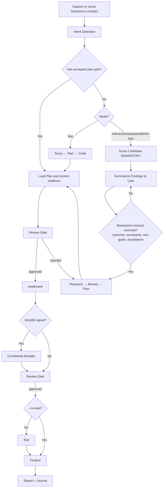

# Cook — Smart Feature Implementation

End-to-end implementation with automatic workflow detection.

**Principles:** YAGNI, KISS, DRY | Token efficiency | Concise reports

## Capability handoff convention

Cook orchestrates a delivery loop by calling companion capabilities. For every
handoff below:

- Use the named capability when the runtime exposes it and the user's request
  permits it; otherwise perform the step inline with native tools (read, search,
  shell, edit).
- If neither path is possible, stop and report the missing capability honestly.
- Never treat an optional capability as required, and never emit a hard external
  command as the only path.

Companion capabilities cook uses, by portable skill name where one exists in
this kit: `scout` (discovery), `research`, `vit-plan` (planning/plan execution),
`code-review`, `test`, `debug`, `git`, `project-management`, `docs`, `journal`,
`fix` (bug routing). A UI/design capability and a simplification capability are
optional; a visual-explanation/preview capability is optional.

## Usage

```
cook <natural language task OR plan path>
```

**IMPORTANT:** With no flag, cook uses `interactive` mode by default.

**Workflow-mode flags:**
- `--interactive`: full workflow with user input (**default**)
- `--fast`: skip research, scout → plan → code
- `--parallel`: multi-agent execution (delegation-gated; sequential fallback)
- `--no-test`: skip the testing step
- `--auto`: auto-approve all steps

**Composable flag** (combine with any mode):
- `--tdd`: tests-first per phase — write tests for current behavior before
  refactoring, then verify they still pass after implementation

**Examples:**
```
cook "Add user authentication to the app" --fast
cook path/to/plan.md --auto
cook "Refactor auth middleware" --tdd
```

<HARD-GATE-BRAINSTORM-FIRST>
Before planning or implementation, capture the opening brainstorm contract:
outcome, constraints, non-goals, and observable acceptance criteria.

- If the input is an accepted plan or design, reuse those fields and identify
  only material gaps.
- If the input is a natural-language task, state the fields from the request and
  ask only about a missing decision that would change the result or safety.
- `--fast`, `--parallel`, and `--auto` change execution shape, not this gate.
- Route concrete bugs to the `fix` capability; it frames intent first, then
  proves the root cause before selecting a solution.
</HARD-GATE-BRAINSTORM-FIRST>

<HARD-GATE>
Do NOT write implementation code until a plan exists and has been reviewed.
This applies regardless of task simplicity. "Simple" tasks are where unexamined
assumptions waste the most time.
Exception: `--fast` mode skips research but still requires a plan step.
User override: if the user explicitly says "just code it" or "skip planning",
respect that instruction.
</HARD-GATE>

<HARD-GATE-SCOUT-FIRST>
After the opening brainstorm gate and before planning, scan the codebase.
Mandatory scout outputs:
1. Project type, language(s), framework(s)
2. Existing modules/files relevant to the task
3. Current patterns/conventions for similar features (so the implementation matches them)
4. Existing docs and any in-flight plans covering this area
5. Public APIs, schemas, contracts the task could affect

State a concise codebase-context summary before asking further questions. Use
the `scout` capability, or native search when it is absent. Skip only when an
accepted plan already contains current scout evidence.
</HARD-GATE-SCOUT-FIRST>

<HARD-GATE-EXACT-REQUIREMENTS>
Before producing a plan, the brainstorm contract must be concrete and scout
evidence must identify likely touchpoints and stable public contracts. Ask only
for a material requirement that neither the request, accepted plan, nor current
evidence resolves. Ground questions in discovered paths and behavior.
</HARD-GATE-EXACT-REQUIREMENTS>

<HARD-GATE-NO-SIDE-EFFECTS>
Implementation is NOT done until verified side-effect-free. The review and test
gates MUST prove:

1. New behavior matches every acceptance criterion above.
2. All tests pass — including tests in modules that share files/contracts with the change.
3. No existing business-logic / workflow regression: explicitly walk each touchpoint and any caller of changed functions.
4. No new lint/type/build errors anywhere in the repo.
5. Public contracts unchanged unless intentional and called out (function signatures, exported types, API responses, DB schemas, env vars, config keys).

User override: if the user invoked `--no-test`, item 2 is downgraded to a
warning. Surface the unverified-tests risk at finalize (via an interactive
prompt capability, or plainly in the summary) so the user accepts the trade-off
rather than having it silently chosen. Items 1, 3, 4, 5 remain enforced via the
mandatory `code-review` step.

If review/testing reveals a side effect, regression, or broken workflow, STOP.
Present (via an interactive prompt capability, or plainly):
- What broke (file, test, workflow, user-facing behavior)
- Why this implementation caused it (1-line cause)
- 2-4 concrete options, e.g.:
  - "Revert this slice and re-plan with stricter scope"
  - "Keep the implementation and update <dependents> to match the new contract"
  - "Add a compatibility shim at <boundary> so old callers keep working"
  - "Accept the regression — old behavior was unintended/buggy"

Let the user decide. Do not silently patch around regressions.
</HARD-GATE-NO-SIDE-EFFECTS>

## Anti-Rationalization

| Thought | Reality |
|---------|---------|
| "This is too simple to plan" | Simple tasks have hidden complexity. Plan takes 30 seconds. |
| "I already know how to do this" | Knowing ≠ planning. Write it down. |
| "Let me just start coding" | Undisciplined action wastes tokens. Plan first. |
| "The user wants speed" | Fastest path = plan → implement → done. Not: implement → debug → rewrite. |
| "I'll plan as I go" | That's not planning, that's hoping. |
| "Just this once" | Every skip is "just this once." No exceptions. |

## Smart Intent Detection

| Input Pattern | Detected Mode | Behavior |
|---------------|---------------|----------|
| Path to `plan.md` or `phase-*.md` | code | Execute existing plan |
| Contains "fast", "quick" | fast | Skip research, scout→plan→code |
| Contains "trust me", "auto" | auto | Auto-approve all steps |
| Lists 3+ features OR "parallel" | parallel | Multi-agent execution |
| Contains "no test", "skip test" | no-test | Skip testing step |
| Default | interactive | Full workflow with user input |

See `references/intent-detection.md` for detection logic. If the task needs a
cross-skill workflow sequence decision after intent detection, load
`references/workflow-routing.md`.

## Process Flow (Authoritative)



**This diagram is the authoritative workflow.** Prose sections and references
provide detail. If prose conflicts with this flow, follow the diagram.

## Workflow Overview

```
[Brainstorm Contract] → [Intent Detection] → [Inspect/Research?] → [Review] → [Plan] → [Review] → [Implement] → [Conditional Simplify?] → [Review] → [Test?] → [Review] → [Finalize]
```

**Default (non-auto):** stops at `[Review]` gates for human approval before each major step.
**Auto mode (`--auto`):** skips human review gates, implements all phases continuously.
**Progress tracking:** discover the live task-management surface at runtime and
use it when available; otherwise update the active plan directly. Plan files are
the durable source of truth.

| Mode | Research | Testing | Review Gates | Phase Progression |
|------|----------|---------|--------------|-------------------|
| interactive | ✓ | ✓ | **User approval at each step** | One at a time |
| auto | ✓ | ✓ | Per `references/review-cycle.md` | All at once (no stops) |
| fast | ✗ | ✓ | **User approval at each step** | One at a time |
| parallel | Optional | ✓ | **User approval at each step** | Parallel groups |
| no-test | ✓ | ✗ | **User approval at each step** | One at a time |
| code | ✗ | ✓ | **User approval at each step** | Per plan |

## Step Output Format

```
✓ Step [N]: [Brief status] - [Key metrics]
```

## Blocking Gates (Non-Auto Mode)

Human review required at these checkpoints (skipped with `--auto`):
- **Post-Research:** review findings before planning
- **Post-Plan:** approve plan before implementation
- **Post-Implementation:** approve code before testing
- **Post-Testing:** 100% pass + approve before finalize

**Always enforced (all modes):**
- **Testing:** 100% pass required (unless no-test mode)
- **Code Review (MANDATORY):** use the `code-review` capability with explicit checks:
  (a) every acceptance criterion met,
  (b) no regression to business logic in touchpoints/blast-radius,
  (c) no breaking changes to public contracts (signatures, schemas, APIs, env vars) unless called out,
  (d) follows existing patterns from scout,
  (e) no new lint/type/build errors anywhere.
  Pass the scout summary + acceptance criteria as context. If review flags side effects → trigger HARD-GATE-NO-SIDE-EFFECTS (present 2-4 options).
  Then: user approval or the auto-mode decision in `references/review-cycle.md`.
- **Finalize (MANDATORY - never skip):**
  1. Use the `project-management` capability (MANDATORY) → run full plan sync-back across ALL `phase-XX-*.md` (not only the current phase), update `plan.md` status/progress, refresh runtime tracking when available, generate a progress report. Native fallback: edit plan/phase checkboxes directly.
  2. Evaluate docs impact; use the `docs` capability only for affected routed authority surfaces.
  3. After sync-back verification, reflect completion in the live task-management surface when available.
  4. Ask the user whether to commit via the `git` capability.
  5. Use the `journal` capability to write a concise technical journal entry upon completion.

## Required Companion Steps

| Phase | Capability | Requirement |
|-------|------------|-------------|
| Research | `research` | Optional in fast/code |
| Scout | `scout` | Optional in code |
| Plan | `vit-plan` | Optional in code |
| UI Work | UI/design capability | If frontend work |
| Testing | `test`, `debug` | **MUST** run |
| Review | `code-review` | **MUST** run |
| Finalize | `project-management`; conditional `docs`; configured `git` workflow | Project sync and docs-impact decision are mandatory |

**CRITICAL ENFORCEMENT:**
- Testing, review, and finalization MUST run through their capability (or native
  fallback). Do NOT skip them.
- If the runtime exposes delegation, prefer delegating these to the matching
  capability; otherwise perform them inline with native tools.
- A workflow that ends without a completed test gate, review gate, and finalize
  contract is INCOMPLETE.

## References

- `references/intent-detection.md` — detection rules and routing logic
- `references/workflow-routing.md` — cross-skill sequence routing for ambiguous workflows
- `references/workflow-steps.md` — detailed step definitions for all modes
- `references/review-cycle.md` — interactive and auto review processes
- `references/subagent-patterns.md` — companion-capability invocation patterns

## Workflow Position

**Typically follows:** `vit-plan` (execute a plan), `brainstorm` (implement an agreed solution).
**Typically precedes:** `code-review` (review after implementation), `test` (validate changes).
**Related:** `fix` (alternative for bug fixes), `vit-plan` (create a plan before cooking).
