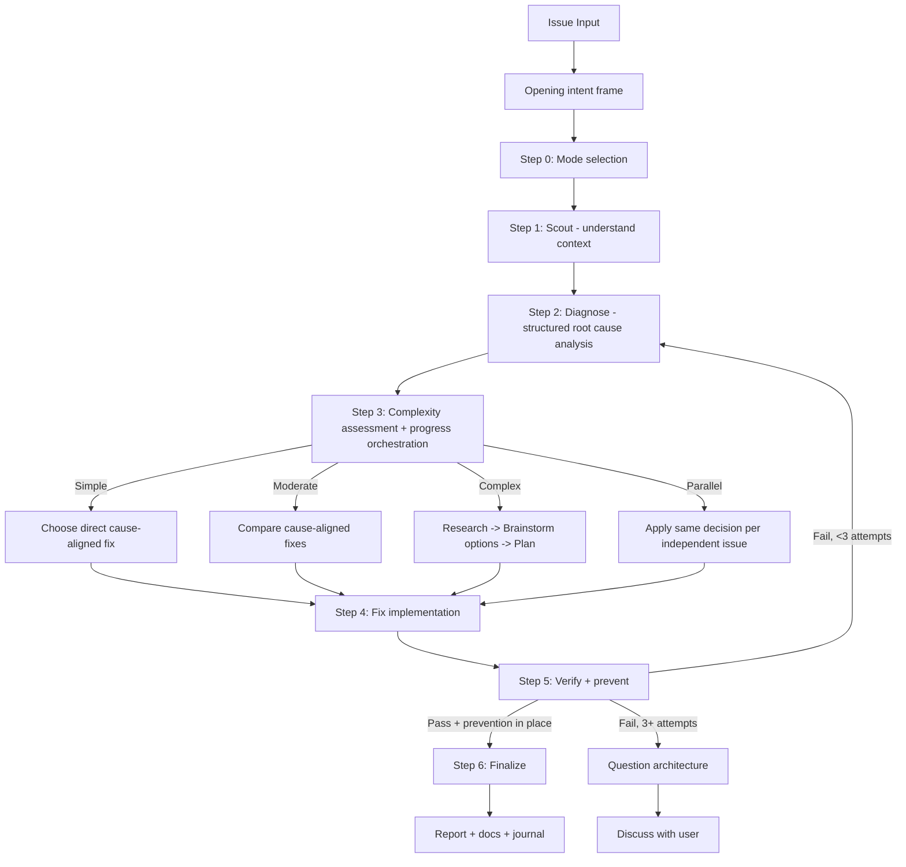

# Fix

Repair a concrete bug, error, test failure, or CI/CD failure with intelligent
routing across bug types. Frame the expected repaired behavior first, prove the
root cause before selecting any fix, apply the smallest cause-aligned repair,
then verify there is no regression.

This skill handles concrete defects — type errors, lint issues, log errors, UI
bugs, failing tests, broken pipelines. It is **not** a feature-implementation
workflow: if the request is to build new behavior rather than repair broken
behavior, hand off to an implementation capability instead.

## Modes

- `--auto` — autonomous mode (**default**): auto-approve when quality is high,
  ask only when stuck.
- `--review` — human-in-the-loop: pause for approval at each major step.
- `--quick` — fast scout -> diagnose -> fix -> verify cycle for trivial issues
  (lint, type errors).
- `--parallel` — route independent issues to parallel implementation agents,
  one non-overlapping scope each, when the runtime permits delegation.

## Capability handoff convention

Several steps below name a companion capability (scouting, debugging/root-cause,
testing, code review, ideation, planning, research, task tracking, docs,
version control, journaling, an interactive prompt, browser verification, or
visual/multimodal analysis). Wherever that happens:

> Use the named capability when the runtime exposes it and the user's request
> permits it; otherwise perform that work inline with native tools (read,
> search, shell). If neither path is possible, stop and report the missing
> capability honestly. Never emit a hard vendor slash-command or a named
> source-subagent call as the only path.

Named companion skills (for example the ported `scout`, `debug`, `test`, and
`code-review` skills) are cited only as examples of a capability, never as a
required invocation. Delegated, external, or parallel-agent execution requires
explicit user permission. Diagnosis and review stay read-only until a fix is
chosen; the fix itself is the only mutating step.

<HARD-GATE-FRAME-FIRST>
Begin with a bounded intent frame before mode selection or diagnosis:

- **Outcome:** the expected repaired behavior.
- **Safety boundary / constraints:** safety, compatibility, ownership, and time
  boundaries the fix must respect.
- **Non-goals:** adjacent behavior this fix must not absorb.
- **Acceptance criteria:** the reproduction and broader evidence that will prove
  the repair complete.

Reuse these fields from an accepted plan when available. This opening gate does
NOT choose a fix. Scout and diagnose the root cause before comparing solutions.
</HARD-GATE-FRAME-FIRST>

<HARD-GATE-DIAGNOSE-BEFORE-FIX>
Do NOT propose or implement a fix before completing Scout + Diagnose. Symptom
fixes are failure. Find the cause first through structured analysis, NEVER
guessing. If 3+ fix attempts fail, STOP and question the architecture — discuss
with the user before attempting more. `--quick` mode allows a fast
scout -> diagnose -> fix cycle for trivial issues (lint, type errors), but never
skips diagnosis.
</HARD-GATE-DIAGNOSE-BEFORE-FIX>

<HARD-GATE-SCOUT-FIRST>
After the opening intent frame, scan the codebase before forming hypotheses or
asking solution-oriented questions. Mandatory scout outputs (collect before
diagnosis):

1. Project type, language(s), framework(s) — from package.json / pyproject.toml
   / go.mod / equivalent.
2. The exact file(s) where the symptom surfaces + their direct
   callers/dependents.
3. Related tests covering the affected area.
4. Recent commits (`git log --oneline -20`) touching scouted files — a possible
   introducer.
5. Existing patterns/conventions for this kind of code, so the fix matches them.

State a concise codebase-context summary before asking for missing diagnostic
evidence. Use the **scouting** capability for this pass when available;
otherwise scan with native search and scoped reads.
</HARD-GATE-SCOUT-FIRST>

<HARD-GATE-EXACT-ROOT-CAUSE>
Do NOT propose a fix until you can answer ALL of these in one concrete sentence
each:

1. **Exact symptom:** precise error message / failing assertion / observed
   behavior (copy verbatim, not paraphrased).
2. **Reproduction steps:** minimal sequence that triggers it (commands, inputs,
   environment).
3. **Expected vs actual:** what SHOULD happen vs what DOES happen.
4. **Root cause (not symptom):** the underlying defect — a specific line,
   missing check, race condition, contract violation, or design flaw. Cite
   `file:line` evidence.
5. **Why now:** what change/condition exposed it (recent commit, data shape,
   env, dependency upgrade).
6. **Blast radius:** every code path that depends on the broken behavior or
   shares the same root cause.

If ANY item is vague ("probably", "I think", "something with…"), gather the
missing facts (logs, repro, env) through the **interactive-prompt** capability
or more scouting/debugging — never guess. Ground every question in scout
findings (specific files, commits, functions), never abstractions.
</HARD-GATE-EXACT-ROOT-CAUSE>

<HARD-GATE-NO-SIDE-EFFECTS>
The fix is NOT done until verified side-effect-free. Verification MUST prove:

1. Original symptom no longer reproduces (re-run the exact pre-fix repro).
2. All tests in modified files + transitively affected modules pass.
3. No business-logic / workflow regression in the **blast radius** identified in
   diagnosis (run those tests too, or manually walk the affected flows).
4. No new lint/type/build errors introduced anywhere.
5. Public API contracts (function signatures, exported types, response shapes,
   DB schemas, env vars) unchanged — OR the change is intentional and called
   out.

If verification reveals a side effect, regression, or broken workflow, STOP. Do
NOT silently patch around it. Use the **interactive-prompt** capability to
present:

- What broke (file, test, workflow).
- Why the fix caused it (1-line cause).
- 2-4 concrete options, e.g.:
  - "Revert the fix and try a different root-cause angle"
  - "Keep the fix and update the dependent code at <files> to match the new
    contract"
  - "Narrow the fix scope to <subset> so the regression goes away"
  - "Accept the regression — it was buggy behavior the test was locking in"

Let the user decide. Do not assume.
</HARD-GATE-NO-SIDE-EFFECTS>

## Anti-rationalization

| Thought | Reality |
|---------|---------|
| "I can see the problem, let me fix it" | Seeing symptoms is not understanding root cause. Scout first. |
| "Quick fix for now, investigate later" | "Later" never comes. Fix properly now. |
| "Just try changing X" | Random fixes waste time and create new bugs. Diagnose first. |
| "It's probably X" | "Probably" means guessing. Use structured diagnosis. Verify first. |
| "One more fix attempt" (after 2+) | 3+ failures means the wrong approach. Question the architecture. |
| "Emergency, no time for process" | Systematic diagnosis is FASTER than guess-and-check. |
| "I already know the codebase" | Knowledge decays. Scout to verify assumptions before acting. |
| "The fix is done, tests pass" | Without prevention, the same bug class recurs. Add guards. |

## Process flow (authoritative)



**This diagram is the authoritative workflow.** If prose conflicts with it,
follow the diagram.

## Workflow

### Step 0: Intent frame & mode selection

First capture or reuse the opening outcome, safety boundary, non-goals, and
acceptance criteria (HARD-GATE-FRAME-FIRST). If the mode is neither explicit nor
safely inferable, use the **interactive-prompt** capability to choose it:

| Option | Recommend when | Behavior |
|--------|----------------|----------|
| **Autonomous** (default) | Simple/moderate issues | Auto-approve if score >= 9.5 and 0 critical |
| **Human-in-the-loop** | Critical/production code | Pause for approval at each step |
| **Quick** | Type errors, lint, trivial bugs | Fast scout -> diagnose -> fix -> review cycle |

See `references/mode-selection.md`.

### Step 1: Scout (MANDATORY — never skip)

**Purpose:** understand the affected codebase BEFORE forming any hypotheses.

1. Use the **scouting** capability, or launch 2-3 parallel exploration agents
   when delegation is permitted; otherwise scan with native search + reads.
2. Discover affected files, dependencies, related tests, recent changes
   (`git log`).
3. Read the project's own docs for context when unfamiliar.

**Quick mode:** minimal scout — locate affected file(s) and direct dependencies
only. **Standard/Deep mode:** full scout — module boundaries, test coverage,
call chains.

**Output:** `Step 1: Scouted - [N] files mapped, [M] dependencies, [K] tests`

### Step 2: Diagnose (MANDATORY — never skip)

**Purpose:** structured root cause analysis. NO guessing. Evidence-based only.

1. **Capture pre-fix state:** record exact error messages, failing test output,
   stack traces, log snippets. This is the baseline for Step 5 verification.
2. Use the **debugging** capability (systematic root-cause investigation and
   call-stack tracing); otherwise investigate inline with structured reasoning
   over read/search/shell evidence.
3. Form hypotheses through structured reasoning, NOT guessing. Test each against
   codebase evidence (parallel exploration agents only when delegation is
   permitted).
4. If 2+ hypotheses fail, switch to a structured problem-solving reframe for
   alternative approaches.
5. Produce a diagnosis: confirmed root cause, evidence chain, affected scope.

Use the root-cause checklist (HARD-GATE-EXACT-ROOT-CAUSE) as the authoritative
diagnosis protocol.

**Output:** `Step 2: Diagnosed - Root cause: [summary], Evidence: [brief], Scope: [N files]`

### Step 3: Complexity assessment & progress orchestration

Classify before routing. See `references/complexity-assessment.md`.

| Level | Indicators | Route |
|-------|------------|-------|
| **Simple** | Single file, clear error, type/lint | `references/workflow-quick.md` |
| **Moderate** | Multi-file, root cause spans files | `references/workflow-standard.md` |
| **Complex** | System-wide, architecture impact | `references/workflow-deep.md` |
| **Parallel** | 2+ independent issues OR `--parallel` | Parallel implementation agents |

**Progress orchestration (Moderate+ only):** after classifying, record all
phases and their dependencies upfront.

- Skip for Quick (< 3 steps, overhead exceeds benefit).
- Use a live **task-tracking** capability when the runtime exposes one;
  otherwise update the active plan as each phase starts/completes.
- For Parallel: keep separate dependency trees and ownership per issue.
- Plan files are the durable source of truth; runtime tracking is never
  required for the fix to proceed.

Select a solution only from the confirmed diagnosis:

- For one safe, direct repair, record why it satisfies the opening contract.
- For multiple viable repairs or an architecture decision, use an **ideation**
  capability to compare trade-offs and resolve the direction before
  implementation; otherwise weigh the options inline against the acceptance
  criteria.
- Deep workflow always includes this post-diagnosis solution comparison and a
  plan. Quick and Standard escalate to Deep when the choice is not direct.

### Step 4: Fix implementation

- Implement the fix per the selected route, updating progress as phases
  complete.
- Fix the ROOT CAUSE, not symptoms.
- Minimal changes only. Follow existing patterns.
- Preserve the opening non-goals and safety boundary; do not widen the fix while
  addressing nearby symptoms.

### Step 5: Verify + prevent (MANDATORY — never skip)

**Purpose:** prove the fix works, has NO side effects, and prevents the same bug
class from recurring. See HARD-GATE-NO-SIDE-EFFECTS.

1. **Verify (iron law):** re-run the EXACT commands from the pre-fix capture.
   Compare output. NO claims without fresh evidence.
2. **Regression test:** add or update test(s) covering the fixed issue via the
   **testing** capability, or run the project's test command directly. The test
   MUST fail without the fix and pass with it.
3. **Side-effect sweep:** run tests across the full **blast radius** from Step 2
   (not just the modified file). Walk each dependent code path. Confirm public
   contracts unchanged (signatures, response shapes, DB schemas, env vars).
4. **Code review:** run the **code-review** capability with explicit
   instructions to check (a) root cause actually addressed, (b) no broken
   business logic in the blast radius, (c) no new failure modes, (d) follows
   existing patterns from scout; otherwise review the changed files inline. Pass
   the scout summary + diagnosis as context.
5. **Prevention gate:** apply defense-in-depth validation where applicable.
6. **Parallel verification:** run typecheck + lint + build + test through the
   shell; split across workers only when delegation is permitted.

**On regression / side effect:** use the **interactive-prompt** capability per
HARD-GATE-NO-SIDE-EFFECTS — present what broke, why, and 2-4 concrete options
(revert / narrow scope / update dependents / accept). Never silently patch.

**If verification fails:** loop back to Step 2 (re-diagnose). After 3 failures,
question the architecture and discuss with the user.

**Output:** `Step 5: Verified + Prevented - [before/after], [N] tests added, [M] guards added`

### Step 6: Finalize (MANDATORY — never skip)

1. Report summary: confidence, root cause, changes, files, prevention measures,
   side-effect sweep results.
2. Sync progress and plan status through the **task-tracking** capability when a
   runtime surface exists; otherwise update the active plan. This is mandatory
   for every fix, but the durable authority is always the plan file.
3. Evaluate docs impact; use the **documentation** capability only when a routed
   authority surface changed; otherwise edit docs directly.
4. Ask the user whether to commit through the **version-control** capability, or
   commit with git via the shell.
5. Optionally record a concise technical journal entry through a **journaling**
   capability when one exists; otherwise skip and note it.

## Output format

Unified step markers:

```
Step 0: Intent framed; [Mode] selected
Step 1: Scouted - [N] files, [M] deps
Step 2: Diagnosed - Root cause: [summary]
Step 3: [Complexity] detected - [route] selected
Step 4: Fixed - [N] files changed
Step 5: Verified + Prevented - [tests added], [guards added]
Step 6: Complete - [action taken]
```

## References

Load as needed:

- `references/mode-selection.md` — interactive-prompt format for mode choice.
- `references/complexity-assessment.md` — classification criteria.
- `references/workflow-quick.md` — Quick: scout -> diagnose -> fix -> verify+prevent -> review.
- `references/workflow-standard.md` — Standard: full pipeline with progress tracking.
- `references/workflow-deep.md` — Deep: research + ideation + plan.
- `references/review-cycle.md` — review logic (autonomous vs human-in-the-loop).
- `references/capability-activation-matrix.md` — which capability to use at each step.
- `references/parallel-exploration.md` — parallel exploration/verification coordination.

**Bug-type routing:**

- `references/workflow-ci.md` — CI/CD pipeline failures.
- `references/workflow-logs.md` — application log analysis.
- `references/workflow-test.md` — test-suite failures.
- `references/workflow-types.md` — type errors.
- `references/workflow-ui.md` — visual/UI issues.

## Workflow position

**Typically starts from:** a concrete bug or failure; it captures intent before
scouting and diagnosis.

**Typically precedes:** a **code-review** capability (review the fix) and a
**testing** capability (validate the fix).

**Related:** a **debugging** capability (diagnose before fixing) and an
implementation capability (the alternative for building new features rather than
repairing broken behavior).
